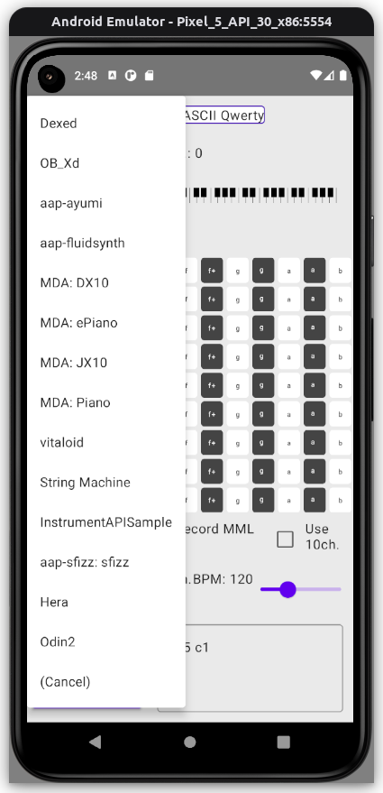
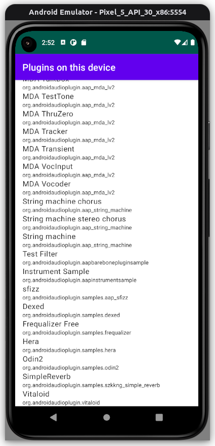
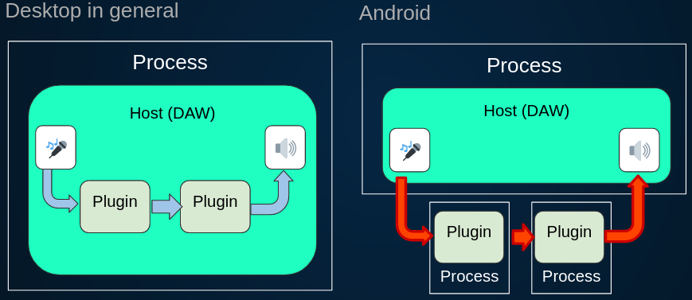

# AAP: Android Audio Plugin Framework

  

 

disclaimer: the README is either up to date, partially obsoleted, or sometimes (but not very often) ahead of implementation (to describe the ideal state). Do not trust it too much.

## What is AAP?

Android lacks commonly used Audio Plugin Framework. On Windows and other desktops, VSTs are popular. On Mac and iOS (including iPadOS) there is AudioUnit. On Linux LV2 is used, to some extent.

There is no such thing in Android. AAP (which implies Android Audio Plugin) Framework is to fill this gap.

What AAP aims is to become like an inclusive standard for audio plugin, adopted to Android applications ecosystem. The license is permissive (MIT). It is designed to be pluggable from other specific audio plugin formats like [VST3](https://github.com/steinbergmedia/vst3sdk), [LV2](https://lv2plug.in/), [CLAP](https://github.com/free-audio/clap), and so on.

On the other hand, it is designed so that cross-audio-plugin SDKs can support it. We have [JUCE](http://juce.com/) integration support, ported some LV2 plugins that use [DPF](https://github.com/DISTRHO/DPF), and probably more in the future. Historically, AAP was first designed to make use of JUCE audio plugin hosting features and JUCE-based audio plugins.

We have [aap-lv2](https://github.com/atsushieno/aap-lv2) and [aap-juce](https://github.com/atsushieno/aap-juce/) repositories that achieve these objectives, to some extent. We have some plugins from these world working (to some extent) - for example: [mda-lv2](https://drobilla.net/software/mda-lv2), [Fluidsynth](https://github.com/FluidSynth/fluidsynth) (as aap-fluidsynth), [sfizz](https://github.com/sfztools/sfizz/), [Guitarix](https://github.com/brummer10/guitarix) in aap-lv2,  [Dexed](https://asb2m10.github.io/dexed/), [OPNplug](https://github.com/jpcima/ADLplug), [OB-Xd](https://github.com/reales/OB-Xd), and [JUCE AudioPluginHost](https://github.com/juce-framework/JUCE/tree/master/extras/AudioPluginHost) in aap-juce. Check out these two subprojects for more comprehensive list. Note that there is no plugin UI integration support yet.

## AAP features, characteristics, unique points

**Android is supported, and it is the first citizen** : no other audio plugin frameworks achieve that (except for [AudioRoute SDK](https://github.com/AudioRoute/AudioRoute-SDK), as far as @atsushieno knows). Hosts and plugins are distributed as different apps and therefore live in different process spaces.

**out-process model, between host activities and plugin services** : AAP is designed to work for Android platform, which has strict separation on each application process space. Namely, we cannot load arbitrary shared libraries from random plugins. Thus AAP DAWs (plugin hosts) and AAPs (plugins) have to communicate through IPC mechanism. AAP uses Binder IPC through NdkBinder API which was introduced at Android 10. Also, the framework makes full use of Android shared memory (ashmem) throughout the audio/MIDI buffer processing.

**Extensibility** : AAP provides extensibility foundation as well as some Standard Extensions such as state and presets (not quite enough to name yet), that are queried by URI. But unlike desktop audio plugin frameworks, a host has to interact with a plugin through Binder messaging (as they live in separate processes by Android platform nature), and therefore an extension has to also provide the messaging implementation called AAPXS (AAP extensibility service) apart from the API itself. We have [some dedicated documentation for extensibility](docs/EXTENSIONS.md) for more details.

**Basically declarative parameter meta data** : like LV2, unlike VST, AU or CLAP, we expect plugin metadata `res/xml/aap_metadata.xml`, described its ports. Parameters can be dynamically populated (since AAP 0.7.4), but declarative parameters would make it more "findable".

**Permissive license** : It is released under the MIT license. Same as CLAP, similar to LV2 (ISC), unlike VST3 or JUCE (GPLv3).

**Works with MIDI Standards** : AAP is pretty much MIDI oriented in a couple of ways.
(1) AAP has ability to turn an instrument plugin into a [Android MidiDeviceService](https://developer.android.com/reference/android/media/midi/package-summary).
(2) AAP supports 32-bit parameters (typically float), and parameter changes are transmitted as MIDI 2.0 UMP System Exclusive 8 messages (via "midi2" input port). LV2 specified Atom, CLAP specified its own events format, and we use UMP.

**C/C++ and Kotlin supported**: public plugin API is provided as the C API. For hosting, some utilized API is implemented for C++ and Kotlin, but officially it is only for reference purpose without stability. While the compatibility at Binder message was pretty stable from 2020 to 2022, AAP is still at infancy and we wouldn't really consider our API as stable. What we recommend instead is to use APIs from audio plugin framework or SDKs, such as JUCE or LV2 API, and port them to AAP.

## How AAPs work: technical background

AAP distribution structure is simple; both hosts (DAWs) and plugins (instruments/effects) can be shipped as Android applications (via Google Play etc.) respectively:

- AAP Host (DAW) developers can use AAP hosting API to query and load the plugins, then deal with audio data processed by them.
- AAP (Plugin) developers works as a service, processes audio and MIDI messages.

From app packagers perspective and users perspective, it can be distributed like a MIDI device service. Like Android Native MIDI (introduced in Android 10.0), AAP processes all the audio stuff in native land (it still performs metadata queries and service queries in Dalvik/ART land).

AAP developers create audio plugin in native code using Android NDK, create plugin "metadata" as an Android XML resource (`aap_metadata.xml`), and optionally implement `org.androidaudioplugin.AudioPluginService` which handles audio plugin connections using Android SDK, then package them together. The metadata provides developer details, port details (as long as they are known), and feature requirement details.

TODO: The plugins and their ports can NOT be dynamically changed, at least as of the current specification stage. We should seriously reconsider this. It will be mandatory when we support so-called plugin wrappers.

## How to create AAP plugins

[Developers Guide](./docs/DEVELOPERS.md) contains some essential guide and some details on various topics.

We have a dedicated plugin development guide for (1) [building from scratch](./docs/PLUGIN_SCRATCH_GUIDE.md), (2) [importing from LV2 plugins](https://github.com/atsushieno/aap-lv2), and (3) [importing from JUCE plugins](https://github.com/atsushieno/aap-juce). We basically recommend (2) or (3) as our API is not quite stabilized yet. So if you take the (1) approach, then you are supposed to update source code whenever necessaey.

(We don't really assure the consistency on how we import LV2 and JUCE bits either, but their API would be mostly stable.)

 
## Code in this repo, and build instructions

There are Android Gradle projects.

You can open this directory in Android Studio (Arctic Fox 2020.3.1 Canary is required) as the top-level project directory and build it.
Or run `./gradlew` there from your terminal.

There is Makefile to build all those Android modules, and install `*.aar`s to local m2 repository. It is used by our CI builds too, including derived projects such as aap-lv2, aap-juce, and further derivative works.

### androidaudioplugin

This library provides AudioPluginService which is mandatory for every AAP (plugin), as well as some hosting functionality.

### androidaudioplugin-ui-compose

`androidaudioplugin-ui-compose` module contains `PluginListActivity` which can be used as a launcher activity by any audio plugin application.

It lists the plugins within the package, and when selected it can perform applying it to either some MIDI sequence or some wave inputs.

The UI is based on Jetpack Compose.

(It depends on `androidaudioplugin-samples-host-engine` internal component to provide in-app plugin preview (tryout) feature which will be rewritten at some stage.)

It is also used by samples/aaphostsample that lists **all** plugins on the system.

### androidaudioplugin-midi-device-service and aap-midi-device-service

AAP instrument plugins can be extended to work as a virtual MIDI device service (software MIDI device).

`aap-midi-device-service` is an example application that turns any instrument plugins into MIDI device services (since it is simply possible).

At this state the audio generation feature not in usable quality at all.

### aaphostsample and aapbarebonepluginsample

`aaphostsample` lists existing AAPs (services) that are installed on the same device, and demonstrates how they work, using some raw audio data example as well as some example MIDI input messages. As of writing this, the app does not respect any audio format and processes in fixed size, and sends some fixed MIDI messages (note on/off-s) to AAP plugins.

`aapbarebonepluginsample` is a sample AAP (plugin) that does "nothing". It can be rather used as a plugin template project.

## Further documentation

[DEVELOPERS.md](docs/DEVELOPERS.md) contains more on plugin and host development.

[PLUGIN_SCRATCH_GUIDE.md](docs/PLUGIN_SCRATCH_GUIDE.md) contains how to get started with plugin development using our own (unstable!) API.

[HACKING.md](docs/HACKING.md) contains how to build and hack this framework itself.

[design/OVERVIEW.md](docs/design/OVERVIEW.md) contains some technical background and design decisions that we have made in this framework.

## Licenses

Android Audio Plugin Framework is released under the MIT License.

In aap-midi-device-service, there are some sources copied from [jalv](https://gitlab.com/drobilla/jalv) project included in aap-midi-device-service module, namely those files under `zix` directory, and they are distributed under the ISC license.

aapinstrumentsample also imports [true-grue/ayumi](https://github.com/true-grue/ayumi) which is distributed under the MIT License.

aap-miid-device-service also imports the following code:

- [google/oboe](https://github.com/google/oboe) which is released under Apache V2 License.
- [g200kg/webaudio-controls](https://github.com/g200kg/webaudio-controls/) which is released under Apache V2 License.
