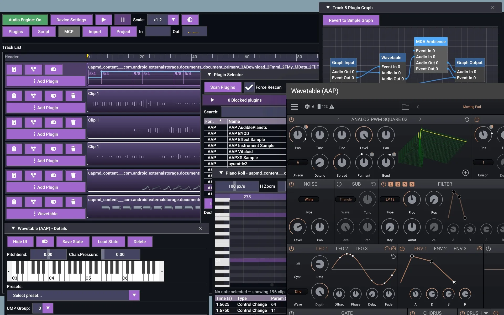
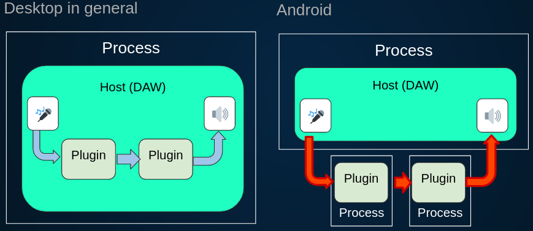

# AAP: Audio Plugins For Android

 ")

disclaimer: the README is either up to date, partially obsoleted, or sometimes (but not very often) ahead of implementation. Do not trust it too much.

## What is AAP?

Android lacks commonly used audio plugin format. On Windows and other desktops, VSTs are popular. On Mac and iOS (including iPadOS) there is AudioUnit. On Linux LV2 is used, as well as VST2 (or compatibility) and VST3.

There is no such thing for Android. Audio Plugins For Android (AAP) is to fill this gap.

AAP aims to provide an inclusive standard for audio plugin, adopted to Android applications ecosystem. The license is permissive (MIT). It is designed to be usable like other specific audio plugin formats like [VST3](https://github.com/steinbergmedia/vst3sdk), [LV2](https://lv2plug.in/), [CLAP](https://github.com/free-audio/clap), and so on, as long as their features are supported in AAP. Note that those desktop formats are not designed to work on Android - AAP is more like [AudioUnit v3 on iOS](https://developer.apple.com/documentation/audiotoolbox/audio_unit_v3_plug-ins).

AAP is designed as a generic plugin format so that multi-format audio plugin SDKs can support it. We have [JUCE](http://juce.com/) integration support. ported some LV2 plugins, including [DPF](https://github.com/DISTRHO/DPF)-based plugins, and probably more in the future.

We have [aap-lv2](https://github.com/atsushieno/aap-lv2) and [aap-juce](https://github.com/atsushieno/aap-juce/) repositories that achieve these objectives to some extent. We have [many plugins]((https://github.com/atsushieno/aap-core/wiki/List-of-AAP-plugins-and-hosts) (as long as they work reasonably on Android).

## Trying it out on Android devices

We have some hacky ["AAP APK Installer"](https://github.com/atsushieno/aap-ci-package-installer) Android application that facilitates installing the latest APK builds from GitHub Actions build artifacts. You can alternatively use [Obtainium](https://obtainium.imranr.dev/) that emerged later.

Note that they are not trusted application for your Android system, whereas they are fully automated except for those packages I upload to DeployGate (you can also build AAP APK Installer from source on Android Studio, which is much easier than building and installing each plugin app from source).

## AAP features, characteristics, unique points

**Android is supported, and it is the first citizen** : no other audio plugin frameworks achieve that (except for the [AudioRoute SDK](https://github.com/AudioRoute/AudioRoute-SDK) in theory). Hosts and plugins are distributed as different apps and therefore live in different process spaces.

**Out-process model, between host activities and plugin services** : AAP is designed to work for Android platform, which has strict separation on each application process space. Namely, hosts cannot load arbitrary shared libraries from plugins that reside in other applications. Thus AAP DAWs (plugin hosts) and AAPs (plugins) have to communicate through IPC mechanism. AAP uses Binder IPC through NdkBinder API which was introduced at Android 10. Also, the framework makes full use of Android shared memory (ashmem) throughout the audio/MIDI buffer processing.

**Plugin GUI in DAW** : AAP supports GUI implemented by each plugin, either in native View (Android 11+) or Web view (complicated data access required). AAP DAWs can launch plugin UI within its own process, without switching DAW Activity and plugin Activity. See [GUI design doc](docs/design/GUI.md) for more details.

**Extensibility** : AAP provides extensibility foundation as well as some Standard Extensions such as state and presets (not quite enough to name yet), that are queried by URI. But unlike desktop audio plugin frameworks, a host has to interact with a plugin through MIDI2 event messaging (as they live in separate processes by Android platform nature), and therefore an extension has to also provide the messaging implementation called AAPXS (AAP extensibility service) apart from the API itself. We have [some dedicated documentation for extensibility](docs/EXTENSIONS.md) for more details.

**Fast meta data scanning without instantiating plugins** : like AudioUnit, LV2 or VST >= 3.7 (unlike VST < 3.6, or CLAP), we expect plugin metadata (`res/xml/aap_metadata.xml`) describes its ports, which is essential to faster plugin scanning.

**Permissive license** : It is released under the MIT license. Same as CLAP and VST3 (3.8+), similar to LV2 (ISC).

**Works with MIDI 2.0 Standards** : AAP makes extensive use of MIDI 2.0 in a couple of ways.
(1) AAP has ability to turn an instrument plugin into a [Android MidiDeviceService](https://developer.android.com/reference/android/media/midi/package-summary). Starting AAP 0.9.0, it also provides support for [MidiUmpDeviceService](https://developer.android.com/reference/android/media/midi/MidiUmpDeviceService) on Android 15 or later.
(2) AAP supports 32-bit parameters (typically float), and parameter changes are transmitted as MIDI 2.0 UMP System Exclusive 8 messages (via "midi2" input port). LV2 specified Atom, CLAP specified its own events format, and we use UMP.

**C/C++ and Kotlin supported**: public plugin API is provided as the C API. For hosting, some utilized API is implemented for C++ and Kotlin, but officially it is only for reference purpose without stability. AAP is still at infancy and we wouldn't really consider our API as stable. What we recommend instead is to use APIs from audio plugin framework or SDKs, such as JUCE or LV2 API for plugins, JUCE or CLAP API for hosting (we provide [a pseudo CLAP API bridge](https://github.com/atsushieno/aap-clap-hosting-helper)), and port them to AAP.

## How AAPs work: technical background

AAP distribution structure is simple; both hosts (DAWs) and plugins (instruments/effects) can be shipped as Android applications (via Google Play etc.) respectively:

- AAP Host (DAW) developers can use AAP hosting API to query and load the plugins, then deal with audio data processed by them.
- AAP (Plugin) developers works as a service, processes audio and MIDI messages.

From app packagers perspective and users perspective, it can be distributed like a MIDI device service. Like Android Native MIDI (introduced in Android 10.0), AAP processes all the audio stuff in native land (it still performs metadata queries and service queries in Dalvik/ART land).

AAP developers create audio plugin in native code using Android NDK, create plugin "metadata" as an Android XML resource (`aap_metadata.xml`), and optionally implement `org.androidaudioplugin.AudioPluginService` which handles audio plugin connections using Android SDK, then package them together. The metadata provides developer details, port details (as long as they are known), and feature requirement details.

## How to create AAP plugins

[Developers Guide](./docs/DEVELOPERS.md) contains some essential guide and some details on various topics. We have a dedicated plugin development guide for:

1. [building from scratch](./docs/PLUGIN_SCRATCH_GUIDE.md)
2. [importing from LV2 plugins](https://github.com/atsushieno/aap-lv2)
3. [importing from JUCE plugins](https://github.com/atsushieno/aap-juce)

We basically recommend (2) or (3) as our API is not quite stabilized yet. So if you take the (1) approach, then you are supposed to update source code whenever necessaey.

(We don't really assure the consistency on how we import LV2 and JUCE bits either, but *their* API would be in general stable.)

## Building

You can open this directory in Android Studio (fairly up-to-date version is required) as the top-level project directory and build it. Or run `./gradlew` there from your terminal.

For more details, see [DEVELOPERS.md](./docs/DEVELOPERS.md) and [HACKING.md](./docs/HACKING.md).

## Further documentation

### wiki pages

- [Screenshots]((https://github.com/atsushieno/aap-core/wiki/Screenshots))
- [List of AAP Plugins and Hosts]((https://github.com/atsushieno/aap-core/wiki/List-of-AAP-plugins-and-hosts))
- [Presentations](https://github.com/atsushieno/aap-core/wiki/Presentations)
- [Are We Audio Plugin Format Yet?](https://github.com/atsushieno/aap-core/wiki/Are-We-Audio-Plugin-Format-Yet%3F)
- [FAQ](https://github.com/atsushieno/aap-core/wiki/FAQ)
- [Participating](https://github.com/atsushieno/aap-core/wiki/Participating)

### static docs

- [DEVELOPERS.md](docs/DEVELOPERS.md) contains more on plugin and host development.
- [PLUGIN_SCRATCH_GUIDE.md](docs/PLUGIN_SCRATCH_GUIDE.md) contains how to get started with plugin development using our own (unstable!) API.
- [HACKING.md](docs/HACKING.md) contains how to build and hack this framework itself.
- [design/OVERVIEW.md](docs/design/OVERVIEW.md) contains some technical background and design decisions that we have made in this framework.

## Licenses

Audio Plugins For Android is released under the MIT License.

In `androidaudioplugin-midi-device-service` module, there are some sources copied from [jalv](https://gitlab.com/drobilla/jalv) project, namely those files under `zix` directory, and they are distributed under the ISC license.

aapinstrumentsample also imports [true-grue/ayumi](https://github.com/true-grue/ayumi) which is distributed under the MIT License.

androidaudioplugin-midi-device-service also imports the following code:

- [google/oboe](https://github.com/google/oboe) which is released under Apache V2 License.
- [g200kg/webaudio-controls](https://github.com/g200kg/webaudio-controls/) which is released under Apache V2 License.

androidaudioplugin-manager imports [Tracktion/choc](https://github.com/Tracktion/choc/) which is released unde the ISC license.
