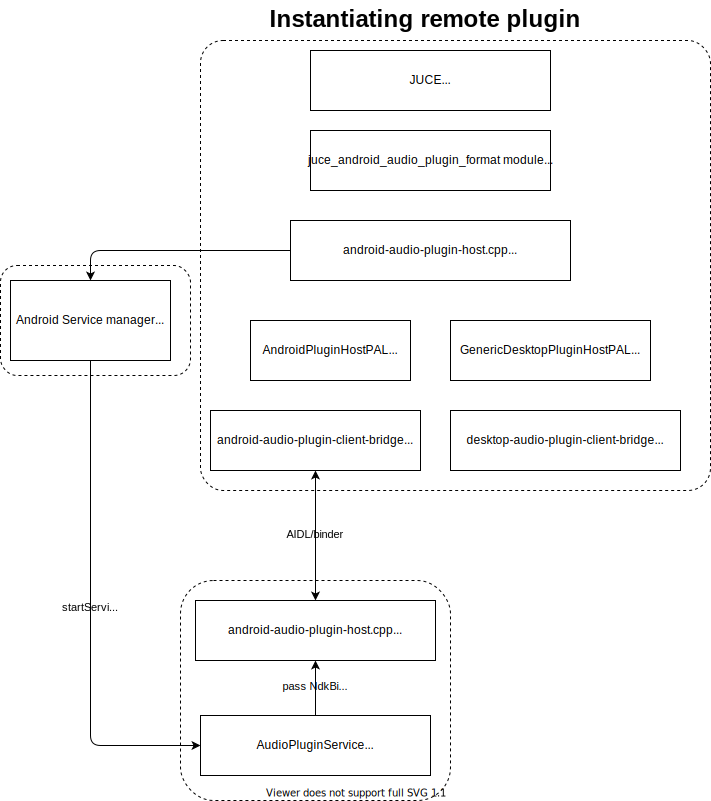

# AAP Developers Guide

## What this documentation is for

The most important and difficult mission for an audio plugin framework like AAP is to get more plugins (hopefully more "quality" plugins, but that is next). Therefore AAP is designed to make existing things reusable. We have [aap-juce](https://github.com/atsushieno/aap-juce/) to import JUCE plugins and [aap-lv2](https://github.com/atsushieno/aap-lv2) to import LV2 plugins to AAP world, to achieve this goal.

Ideally, as long as you have your plugin in either of those plugin structures, you could just import it, as long as the code is designed to work on Android (i.e. not resorting to desktop specifics such as files, or avoid "sync" API such as those in JUCE FileChooser). If you got things working along with these ways, you would't have to understand the AAP architecture described below.

## AAP package bundle

An AAP (plugin) is packaged as an apk or aab. The plugin is implemented in native code, built as a set of shared libraries.

There is some complexity on how those files are packaged. At the "AAP package helpers" section we describe how things are packaged for each migration pattern.

### Queryable service manifest for plugin lookup

Unlike Apple Audio Units, AAP plugins are not managed by Android system. Instead, AAP hosts can query AAPs using PackageManager which can look for specific services by intent filter `org.androidaudioplugin.AudioPluginService.V2` and AAP "metadata". Here we follow what Android MIDI API does - AAP developers implement `org.androidaudioplugin.AudioPluginService` class and specify it as a `<service>` in `AndroidManifest.xml`. Here is an example:

```
<manifest xmlns:android="http://schemas.android.com/apk/res/android"
          package="org.androidaudioplugin.samples.aapbarebonesample">

  <application ...>
    ...
    <service android:name="org.androidaudioplugin.AudioPluginService"
       android:exported="true" android:label="AAPBareBoneSamplePlugin">
      <intent-filter>
        <action android:name="org.androidaudioplugin.AudioPluginService.V2" />
      </intent-filter>
      <meta-data 
	      android:name="org.androidaudioplugin.AudioPluginService.V2#Plugins"
	      android:resource="@xml/aap_metadata"
        />
    </service>
  </application>
</manifest>
```

The `<service>` element comes up with two `<meta-data>` elements.

You can also specify "extensions" by a `meta-data`, whose `android:name` attribute specifies `org.androidaudioplugin.AudioPluginService.V2#Extensions` , and whose `android:value` indicates a ',' (comma)-separated list of "extension" classes. They are loaded via `Class.forName()` and initialized at host startup time with an `android.content.Context` argument.

The `meta-data` whose `android:name` is `org.androidaudioplugin.AudioPluginService.V2#Plugins` should specify `@xml/aap_metadata` in `android:resource` attribute, and there should be `res/xml/aap_metadata.xml` in the project. The file content looks like this:

```
<plugins xmlns="urn:org.androidaudioplugin.core"
         xmlns:pp="urn:org.androidaudioplugin.port">
  <plugin manufacturer="AndroidAudioPluginProject"
          name="BareBoneSamplePlugin">
    <parameters xmlns="urn://androidaudioplugin.org/extensions/parameters">
      <parameter id="0" name="Output Volume L" default="0.5" minimum="0" maximum="1" />
      <parameter id="1" name="Output Volume R" default="0.5" minimum="0" maximum="1" />
      <parameter id="2" name="Delay L" default="0" minimum="0" maximum="2048" type="integer" />
      <parameter id="3" name="Delay R" default="256" minimum="0" maximum="2048" type="integer" />
    </parameters>
    <ports>
      <port direction="input" content="midi2" name="MIDI In" />
      <port direction="output" content="midi2" name="MIDI Out" />
      <port direction="input" content="audio" name="Left In" />
      <port direction="input" content="audio" name="Right In" />
      <port direction="output" content="audio" name="Left Out" />
      <port direction="output" content="audio" name="Right Out" />
    </ports>
  </plugin>
  
  (more <plugin>s, if any...)
</plugins>
```

In `AndroidManifest.xml`, only one `<service>` and an `aap_metadata.xml` file is required. A plugin application package can contain more than one plugins (like an LV2 bundle can contain more than one plugins e.g. [aap-lv2-mda](https://github.com/atsushieno/aap-lv2-mda) does), and they have to be listed on the AAP metadata.

The `aap_metadata.xml` metadata format is somewhat hacky for now and subject to change. The metadata content is similar to what LV2 metadata `*.ttl` provides. AAP hosts can query AAP metadata resources from all the installed app packages, without instantiating those AAP services (XML is the only viable format for that; it is impossible to choose JSON for example).

Here is the XML content details:

- `<plugin>` element
  - `manufacturer` attribute: name of the plugin manufacturer or developer or whatever. (TODO: we may rename it to `developer`. `manufacturer` sounds like MIDI too much, which were mostly for hardware vendors.)
  - `name` attribute: the display name of the plugin.
  - `unique-id` attribute: unique ID like `urn:org.androidaudioplugin/samples/aapbarebonepluginsample/TestFilter` .
  - `version` attribute: version ID of the plugin like `1.0`.
  - `category` attribute: category of the plugin. (Currently we expect `Instrument` or `Effect` but maybe this is going to be unnecessary.)
  - `library` attribute: native library file name that contains the plugin entrypoint
  - `entrypoint` attribute: name of the entrypoint function name in the library. If it is not specified, then `GetAndroidAudioPluginFactory` is used.
- `<ports>` element - defines ports.
  - `<port>` element
    - `name` attribute: the display name.
    - `direction` attribute: either `input` or `output`.
    - `content` attribute: `audio` or `midi2`. (explained later)
    - `minimumSize` attribute: specifies the minimum buffer size in bytes.
- `<parameters>` element - defines a parameter group (can be nested). Note that it resides in its own namespace (since it works as an extension)
  - `name`: attribute: parameter group name.
  - `<port>` element
    - `id` attribute: the parameter id integer from `0` to `65535`. It is supposed to not change as long as parameter compatibility is kept. It does not have to be sorted in order, and can have skipped numbers.
    - `name` attribute: the display name.
    - `minimum`, `maximum` attributes: specifies value ranges.
    - `default` attribute: specifies the default value.
    - `<enumeration>` element: specifies a candidate value. TODO: currently not implemented.
      - `label` attribute: value label that is shown to user.
      - `value` attribute: the actual value.

`unique-id` is used by AAP hosts to identify the plugin and expect compatibility e.g. state data and versions, across various environments. We end up using some URI like `urn:(http-ish plugin-name)`. For example, LV2 identifies each plugin via URI. Therefore we use `lv2:{LV2 URI}` when importing from the LV2 metadata.

`library` is to specify the native shared library name. It is mandatory; if it is skipped, then it points to `androidaudioplugin` which is our internal library which you have no control.

`entrypoint` is an optional attribute to sprcify custom entrypoint function. `GetAndroidAudioPluginFactory()` is the default value. It is useful if your library has more than one plugin factory entrypoints (like our `libandroidaudioplugin.so` does).

In the current specification, the parameter type is 32-bit float. `enumeration` will restrict the value options to the child `<enumeration>` element items. (TODO: not implemented yet)

## AAP Plugin API and implementation

### API references

[Native and Kotlin API references](https://atsushieno.github.io/aap-core/) are generated by GitHub Actions task.

They are by no means stable and are subject to any changes. For stable development, we recommend to rather depend on LV2 API and use aap-lv2, or JUCE API and use aap-juce.

There is also an AIDL within the repo. For better backward compatibility we try to minimize changes to it, but it is meant to be totally for internal use only.

### plugin API

From each audio plugin's point of view, it is locally instantiated by each service application. Here is a brief workflow for a plugin from the beginning, through processing audio and MIDI inputs (or any kind of controls), to the end:

- get plugin factory
- instantiate plugin (pass plugin ID, sampleRate, and extensions)
- prepare (pass initial buffer pointers)
- activate (DAW enabled it, playback is active or preview is active)
- process audio blocks and/or MIDI2 events (pass buffer pointers)
- deactivate (DAW disabled it, playback is inactive and preview is inactive)
- terminate and destroy the plugin instance

This is mixture of what LV2 does and what VST3 plugin factory does.

Here is an example:

```
void sample_plugin_delete(
	AndroidAudioPluginFactory *pluginFactory,
	AndroidAudioPlugin *instance)
{
	delete instance;
}

void sample_plugin_prepare(AndroidAudioPlugin *plugin, AndroidAudioPluginBuffer* buffer)
{
	/* do something */
}

void sample_plugin_activate(AndroidAudioPlugin *plugin) {}

void sample_plugin_process(AndroidAudioPlugin *plugin,
	AndroidAudioPluginBuffer* buffer,
	long timeoutInNanoseconds)
{
	/* do something */
}

void sample_plugin_deactivate(AndroidAudioPlugin *plugin) {}

AndroidAudioPluginState state;
void sample_plugin_get_state(AndroidAudioPlugin *plugin, AndroidAudioPluginState* result)
{
	/* fill state data into result */
}

void sample_plugin_set_state(AndroidAudioPlugin *plugin, AndroidAudioPluginState *input)
{
	/* apply argument input state to the plugin */
}

typedef struct {
    /* any kind of extension information, which will be passed as void* */
} SamplePluginSpecific;

AndroidAudioPlugin* sample_plugin_new(
	AndroidAudioPluginFactory *pluginFactory,
	const char* pluginUniqueId,
	int sampleRate,
	AndroidAudioPluginHost *host)
{
	return new AndroidAudioPlugin {
		new SamplePluginSpecific {},
		sample_plugin_prepare,
		sample_plugin_activate,
		sample_plugin_process,
		sample_plugin_deactivate,
		sample_plugin_get_extension
		};
}

AndroidAudioPluginFactory* GetAndroidAudioPluginFactory ()
{
	return new AndroidAudioPluginFactory { sample_plugin_new, sample_plugin_delete, nullptr };
}
```

`GetAndroidAudioPluginFactory` function is the entrypoint. You can customizible it per plugin (if you do so, specify it on `aap_metadata.xml`), to make it possible to put multiple factories in one shared library. We don't have any example that needed it though (as the `instantiate` function member takes `pluginUniqueId` argument to identify one from multiple plugins).


## Hosting AAP

We have an AAP proof-of-concept host in `samples/aaphostsample` directory. Note that it is a static audio geenrator for now, not a live audio processing client.

AAP plugins are queried via `AudioPluginHostHelper.queryAudioPluginServices()` which subsequently issues `PackageManager.queryIntentServices()`, connected using binder. `aaphostsample` issues queries and lists only remote AAPs.

### Important new requirement for Android 11 or later

Android 11 brought in a new restriction on querying information on other applications on the local system. To make service query based on Android intent, we now have to add [`queries` element](https://developer.android.com/guide/topics/manifest/queries-element) to `AndroidManifest.xml` in any AAP host application within `<manifest>` element:

```
    <queries>
        <intent>
            <action android:name="org.androidaudioplugin.AudioPluginService.V2" />
        </intent>
    </queries>
```

### AAP Kotlin hosting API

AAP hosting API is exposed to Kotlin to some extent, but it is for limited feature. Kotlin is not designed to be realtime safe. Android Binder for applications is not RT-safe either, but that's another story. We'd keep trying to make native implementation closer to RT-safe.

On the other hand, even with the native API, we still have to resort to Kotlin (JVM) API, as there is no NDK API to query and bind Android Service. Therefore, in some AAP native API, we dynamically query and bind AudioPluginServices. We actually manage client's bound AudioPluginServices using `org.androidaudioplugin.hosting.AudioPluginServiceConnector` and `org.androidaudioplugin.hosting.PluginServiceConnection`.

### AAP native hosting API

It is similar to LV2. Ports are connected only by id (an index-like integer) and no port instance structure for runtime buffers. (We know it is [ugly](https://drobilla.net/2019/11/11/lv2-the-good-bad-and-ugly.html), but Android Binder API does not provide any way to pass multiple shared memory pointers at once anyways.)

Unlike LV2, hosting API is actually used by plugins too, because it has to serve requests from remote host, process audio stream locally, and return the results to the remote host. But plugin developers shouldn't have to worry about it. It should be as easy as implementing plugin API and package in AAP format.

Currently, the Hosting API is provided only in C++. They are in `aap` namespace.

- Types
  - `class PluginHost`
    - `class PluginService` for service implementation (not really intended for public use)
    - `class PluginClient` for hosting implementation
  - `class PluginClientSystem`
    - `class AndroidPluginClientSystem`
    - `class DesktopPluginClientSystem` (it does not exist yet)
  - `class PluginInformation`
  - `class PortInformation`
  - `class PluginInstance`
    - `class LocalPluginInstance` for service's plugin instances
    - `class RemotePluginInstance` for client's plugin instances
  - `enum aap::ContentType`
  - `enum aap::PortDirection`
  - `enum aap::PluginInstantiationState`

The API is still not really well-thought at this state and subject to any changes.

### Accessing Remote plugin

Plugin developers don't really have to deal with hosting. The only connected point would be extensions, which is explained in [`EXTENSIONS.md`](./EXTENSIONS.md).

Host developers would use `PluginClient` class to instantiate plugins from various (one or more) AudioPluginServices. It requires live connection list instance (`PluginClientConnectionList*`) and a snapshot of plugin list (`PluginListSnapshot*`), which require some JNI interaction on Android.

`PluginListSnapshot` is easy to acquire - there is `PluginListSnapshot::queryServices()` that dispatches query to Intent Service via Android (Java) API and get results. `PluginClientConnectionList` is a little bit more complicated - you can create new `PluginClientConnection` object with NdkBinder, which can be acquired only through `android.content.Context.bindService()` i.e. via Android (Java) API (again).

Plugins that have the bound service in `PluginClientConnectionList` can be instantiated in synchronous API `PluginClient::createInstance()`. For others, asynchronous `PluginClient::createInstanceAsync()` has to be used. It dispatches instantiation process to `PluginClientSystem` to dynamically bind service. For Android it is `AndroidPluginClientSystem`which simply runs `Context.bindService()`. (There could be desktop version of the API feature parity, which is not implemented yet.)

Those create~ methods only returns the instance ID, but you can easily get the actual `aap::RemotePluginInstance` instance via `getInstance()`. This instance lets you do the rest of the plugin processing (prepare/activate/process/deactivate).

There may be further changes to the API around there, but so far that's how things would work.

### native PluginClient instancing internals

(TODO: this section should probably go into HACKING.md)

This section describes some internals about `aap::PluginClient::createInstanceAsync()`. Plugin host developers can just use this function.

Remote plugins can be accessed through AAP "client bridge" which is publicly just an AAP plugin (so that general AAP Hosts can instantiate locally), while it implements the API as a Service client, using NdkBinder API.

Each AAP resides in an application, and it works as an Android Service, named ` org.androidaudioplugin.AudioPluginService`. There is an AIDL which somewhat similar to the AAP plugin API (but with an instance ID, and has more callable methods):

```
package org.androidaudioplugin;

interface AudioPluginInterface {

	int beginCreate(String pluginId, int sampleRate);
	void addExtension(int instanceID, String uri, in ParcelFileDescriptor sharedMemoryFD, int size);
	void endCreate(int instanceID);

	boolean isPluginAlive(int instanceID);

	void prepare(int instanceID, int frameCount, int portCount);
	void prepareMemory(int instanceID, int shmFDIndex, in ParcelFileDescriptor sharedMemoryFD);
	void activate(int instanceID);
	void process(int instanceID, int timeoutInNanoseconds);
	void deactivate(int instanceID);
	
	void destroy(int instanceID);
}

```

Due to [AIDL tool limitation or framework limitation](https://issuetracker.google.com/issues/144204660), we cannot use `List<ParcelFileDescriptor>`, therefore `prepareMemory()` is added apart from `prepare()` to workaround this issue.


## Development Tips

### Running host sample app and plugin sample app

AAP is kind of client-server model, and to fully test AAP framework there should be two apps (for a client and a server). There are `aaphostsample` and `aapbarebonesample` within this repository, but `aap_lv2_mda` in [aap-lv2](https://github.com/atsushieno/aap-lv2) contains more complete plugin examples. Both host and plugins have to be installed to try out.

On Android Studio, you can switch apps within this repository, and decide which to launch.

There is also `AudioPluginHost` example in [aap-juce](https://github.com/atsushieno/aap-juce) which has more comprehensive plugin hosting features. It likely expose more buggy behaviors in the current souce code in either of the repositories.

### Fundamentals

The diagram below illustrates how remote plugins are instantiated. (NOTE: this diagram is partly outdated, and it gives wrong impression that we depend on JUCE. We don't; it is an example use case that shows how we imported JUCE AudioPluginHost in AAP world.)



### Debugging Audio Plugins (Services)

It usually does not matter, but sometimes it does - when you would like to debug your AudioPluginServices *without launching MainActivity*, an important thing to note is that services (plugins) are not debuggable until you invoke `android.os.Debug.waitForDebugger()`, and you cannot invoke this method when you are NOT debugging (it will wait forever!) as long as the host and client are different apps. This also applies to native debugging via lldb (to my understanding).

### Build with AddressSanitizer

When debugging AAP framework itself (and probably plugins too), AddressSanitizer (ASan) is very helpful to investigate the native code issues. [The official Android NDK documentation](https://developer.android.com/ndk/guides/asan) should work as an up-to-date normative reference.

To enable asan in this project, there are three things to do:

- In `aap-core` repo, which is maybe submoduled:
  - run `./setup-asan-for-debugging.sh` to copy asan runtime shared libraries from NDK. You might have to adjust some variables in the script.
  - In the top-level `build.gradle.kts`, change `enable_asan` value to `true`. It will delegate the option to cmake as well as enable the ASAN settings in the library modules as well as sample apps.
- In your app module (or ours outside this repo e.g. `aap-juce-plugin-host/app`):
  - Similarly to `./setup-asan-for-debugging.sh` in this repo, you will have to copy ASAN libraries and `wrap.sh` into the app module. For more details, see [NDK documentation](https://developer.android.com/ndk/guides/asan).
    - **WARNING**: as of May 2022 there is a blocking NDK bug that prevents you from debugging ASAN-enabled code. See [this issue](https://github.com/android/ndk/issues/933) and find the latest script fix. We now have a temporary fix and actually use the script from there, but as it often happens, such a stale file could lead to future issues when the issue is fixed in the NDK upgrades. It should be removed whenever the issue goes away.
  - Add `android { packagingOptions { jniLibs { useLegacyPackaging = true } } }` (you would most likely have to copy "part of" this script in your existing build script e.g. only within `androoid { ... }` part)
  - Add `android:extractNativeLibs='true'` on `<application>` element in `AndroidManifest.xml`

Note that the ASAN options are specified only for `libandroidaudioplugin.so` and the plugin e.g. `libaapbareboneplugin.so`. To enable ASAN in other projects and their dependencies, pass appropriate build arguments to them as well.
