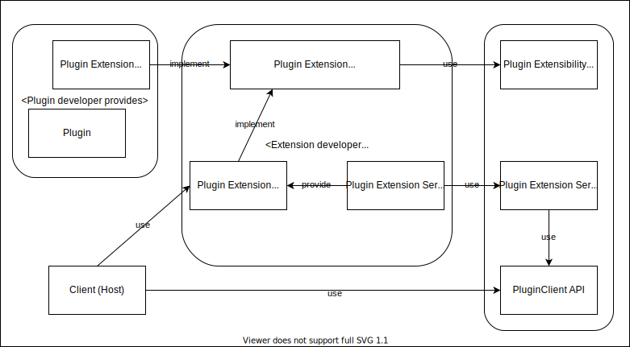

# AAP Extension Developer Guide

## What Extensibility means for AAP

AAP is designed to be extensible, which means, anyone can define features that can be used by both host and client. Lots of AAP features are implemented as AAP Extensions. Plugin extensbility is conceptually similar to VST-MA, LV2, and CLAP Extensions, to minimize the negative impact of breaking changes. (In principle, breaking changes should not happen, but history tells things happen.)

On the other hand, AAP is unique in that it has to work **across separate processes** (host process and plugin processes), which makes extensibility quite complicated. The most noticeable difference from LV2 and CLAP is that we cannot simply provide functions without IPC (Binder on Android), as the host cannot simply load plugin extension implementations via `dlopen()`.

Therefore, any plugin extension feature has to be explicitly initialized and declared at client host, and passed to plugin service through the instantiation phase. Host can provide a shared data pointer which can be referenced by the plugin at any time (e.g. its `process()` phase).

We call it AAP Extension Service API a.k.a. "AAPXS" API.

(We abbreviate AAP Extension Service as AAPXS, and name the relevant C header file as `aapxs.h`. It is going to be too long if we didn't. Also, the abbreviated name would give "it's not for everyone" feeling, which is scary *and* appropriate. Only extension developers and AAP framework developers should use it.)

## Scope of openness

Conceptually AAP could come up with multiple implementations i.e. other implementations of `org.androidaudioplugin.AudioPluginService` than our `androidaudioplugin.aar` or `libandroidaudioplugin.so`, but that is not what we aim right now. Therefore, unlike other plugin extensibility design, our extensions are totally based on `libandroidaudioplugin` implementation.

We could simply give up extensibility and decide that all the features are offered in AAP framework itself, like AudioUnit does not provide extensibility. But we (AAP framework developers) still need some extensibility for AAP framework development for API stability. Thus extensibility framework matters for us.

### supported languages

Both Extensions API (for plugin developers and host developers) and AAPXS API (for extension developers) are in C API. In the actual standard extensions implementation, we use C++ with C API wrapper.

C is chosen for interoperability with other languages. Note that only languages like C++, Rust and Zig are feasible for audio development. And we haven't really examined interoperability with those languages (yet).


## Extension definition

AAP extension is defined in two areas so far:

- code in extension API
- XML elements and attributes on `aap_metadata.xml`

XML extensibility should be defined in their own namespace URI. For standard extensions, schemas in RELAX NG compact syntax are placed at `docs/schemas`.

## Extension API design: Who needs to implement what

For an extension, users are plugin developers and host developers. They want to implement simple API. They are not supposed to implement every complicated IPC bits that AAP extensions actually need under the hood. Thus, extension developers are supposed to offer not just the API definition, but also IPC implementation.



### How plugin developers use extensions

Plugin developers need to "implement" the plugin extension functions, defined as function pointers, by themselves, and that can be fully local (without any IPC concern).

For example, consider "Presets" extension. Plugins that support this extension will have to provide the following features -

- "get preset" operation that transmits data content
- to supplement memory management work the extension API also needs to define "get preset size" operation
- We also need preset catalog, and thus "get preset count" is needed
  - We also need a preset metadata entry retriever (without data) - but this can be unified to "get preset" oepration.
- Lastly, (I had hesitated for long time because of design ambiguity, but) we add "get current preset index"
- and "set current preset index" operations.

Thus it looks like:

```C++
#define AAP_PRESETS_EXTENSION_MAX_NAME_LENGTH 256

typedef struct aap_preset_t {
    int32_t index{0};
    char name[AAP_PRESETS_EXTENSION_MAX_NAME_LENGTH];
    void *data;
    int32_t data_size;
} aap_preset_t;

typedef struct aap_presets_extension_t {
    void* aapxs_context;
    RT_UNSAFE int32_t (*get_preset_count) (aap_presets_extension_t* ext, AndroidAudioPlugin* plugin);
    RT_UNSAFE int32_t (*get_preset_data_size) (aap_presets_extension_t* ext, AndroidAudioPlugin* plugin, int32_t index);
    RT_UNSAFE void (*get_preset) (aap_presets_extension_t* ext, AndroidAudioPlugin* plugin, int32_t index, bool skipBinary, aap_preset_t *preset);
    RT_UNSAFE int32_t (*get_preset_index) (aap_presets_extension_t* ext, AndroidAudioPlugin* plugin);
    RT_UNSAFE void (*set_preset_index) (aap_presets_extension_t* ext, AndroidAudioPlugin* plugin, int32_t index);
} aap_presets_extension_t;
```

To make it implementable in C, the functions are defined as function pointers in the structure.

Here is an example plugin that supports this Presets extension:

```C++
uint8_t preset_data[][3] {{10}, {20}, {30}};

aap_preset_t presets[3] {
    {0, "preset1", preset_data[0], sizeof(preset_data[0])},
    {1, "preset2", preset_data[1], sizeof(preset_data[1])},
    {2, "preset3", preset_data[2], sizeof(preset_data[2])}
};

int32_t sample_plugin_get_preset_count(aap_presets_extension_t* ext, AndroidAudioPlugin* plugin) {
    return sizeof(presets) / sizeof(aap_preset_t);
}

int32_t sample_plugin_get_preset_data_size(aap_presets_extension_t* ext, AndroidAudioPlugin* plugin, int32_t index) {
    return presets[index].data_size; // just for testing, no actual content.
}

void sample_plugin_get_preset(aap_presets_extension_t* ext, AndroidAudioPlugin* plugin, int32_t index, bool skipContent, aap_preset_t* preset) {
    preset->index = index;
    strncpy(preset->name, presets[index].name, AAP_PRESETS_EXTENSION_MAX_NAME_LENGTH);
    preset->data_size = presets[index].data_size;
    if (!skipContent && preset->data_size > 0)
        memcpy(preset->data, presets[index].data, preset->data_size);
}

int32_t sample_plugin_get_preset_index(aap_presets_extension_t* ext, AndroidAudioPlugin* plugin) {
    return (int32_t) (int64_t) ext->aapxs_context; // it should be actually per `plugin` in practice...
}

void sample_plugin_set_preset_index(aap_presets_extension_t* ext, AndroidAudioPlugin* plugin, int32_t index) {
    ext->aapxs_context = (void*) index; // it should be actually per `plugin` in practice...
}

// AAP Presets extension (instance) that this Foo plugin implements
void* sample_plugin_get_extension(AndroidAudioPlugin* plugin, const char *uri) {
    if (strcmp(uri, AAP_PRESETS_EXTENSION_URI) == 0)
        return &presets_extension;
    return nullptr;
}

// Foo plugin instance used by the factory (outside this snippet).
AndroidAudioPlugin *sample_plugin_new(...) {
    return new AndroidAudioPlugin{
            handle,
			...
            sample_plugin_get_extension
    };
}
```

A plugin that supports some extension needs to provide `get_extension()` member of `AndroidAudioPlugin`, and it is supposed to return a corresponding extension to the argument extension URI. In this example, `foo_get_extension()` implements this and returns `foo_preset_extension` for the Presets extension URI (strictly speaking, ID int value of the URI).

The extension is then cast to the appropriate type (in the snipped above it is `aap_preset_extension_t`) and its member is to be invoked by the host (actually not directly by host, but it is explained later).

There is an additional advanced concept - use of `AndroidAudioPluginHost`. Some AAP extensions may pass initial data by host. For example, MIDI2 extension may be initialized by host by its supported MIDI protocols (1.0 and/or 2.0). The `instantiate` member function of `AndroidAudioPlugin` is invoked with an `AndroidAudioPluginHost` struct argument. It is an abstraction in AAP plugin API which works as a host feature facade. The facade offers `get_extension_data` function which is supposed to return an implementation of the extension that delegates to "plugin service extension" instance, with the shared storage space.

### How client (host) developers use extensions

Plugin host developers would also like to use simple API, and they are not supposed to implement the complicated IPC bits. Hosts don't have to implement the extension function members, but they cannot load the plugin's shared library into the host application process. So, hosts use "IPC proxies" that the extension developers provide instead.

Therefore, the host code looks like this:

```C++
aap::RemotePluginInstance* pluginInstance;
auto presets = (aap_preset_extension_t*) pluginInstance->getExtension(AAP_PRESETS_EXTENSION_URI);
aap_preset preset;
preset.data_size = presets->get_preset_size(0);
presets->get_preset(0);
```

It is what I described "IPC proxies" earlier, but we need a lot more explanation.

### What Extension developers need to provide

First to mention, an extension developer needs to provide C header for the extension API for plugin developers. The API will be then implemented by each plugin developer.

Then the way bigger second task begins... as I wrote earlier, plugin client (host) has to invoke the extension functions via proxies, and it is (should be) actually offered by the extension developers.

It should also be noted that the messaging framework part that we (AAP developers) implement is actual host code agnostic, which means that we have to make it generic and extension agnostic i.e. we cannot simply switch-case per our official extensions.

Similarly to client side, our AudioPluginService native internals also have to be implemented as extension agnostic.

Therefore we come up with some generalized API like this. `onInvoked()` is invoked by AudioPluginService internals, and `getPreset()` in this example is ultimately called by extension host developers (as in `aap_preset_extension_t::get_preset` function member).

To achieve this, AAP comes up with a struct named `AAPXSFeature`, which provides access to those two features, as service `on_invoked` and client `as_proxy`;

```C++
typedef void (*aapxs_feature_on_invoked_t) (
        struct AAPXSFeature* feature,
        void *service,
        AAPXSServiceInstance* extension,
        int32_t opcode);

typedef void* (*aapxs_feature_as_proxy_t) (
        struct AAPXSFeature* feature,
        AAPXSClientInstance* extension);

typedef struct {
	const char *uri;
    void *context;
    int32_t shared_memory_size;
	aap_service_extension_on_invoked_t on_invoked;
	aap_service_extension_as_proxy_t as_proxy;
} AAPXSFeature;
```

`AAPXSServiceInstance` and `AAPXSClientInstance` are defined in `aapxs.h`, and provide access to extension instance data such as the extension URI and the shared pointers. They are not to represent the entire AAPXS instances and exist more like the facades:

```C++
typedef struct {
    void *context;
    const char *uri;
    int32_t plugin_instance_id;
    void *data;
    int32_t data_size;
} AAPXSServiceInstance;

typedef void (*aapxs_client_extension_message_t) (
        struct AAPXSClientInstance* aapxsClientInstance,
        int32_t opcode);

typedef struct AAPXSClientInstance {
    void *context;
    const char *uri;
    int32_t plugin_instance_id;
    void *data;
    int32_t data_size;
    aapxs_client_extension_message_t extension_message;
} AAPXSClientInstance;
```

Now that we understand what we will implement, let's move to the actual use case of this API: Presets PluginService extension implementation (it is not really updated to match the latest implementation, but would give you the rough idea):

```C++
	// C++ implementation details
	class PresetsExtensionService {
		AndroidAudioPluginHost host; // set up outside this snippet
		aap_preset_extension_t proxy;

	public:
		const int32_t OPCODE_GET_PRESET = 0;

		// service side
		void onInvoked (
			AndroidAudioPluginHost *service,
			AAPXSServiceInstance* serviceExtension) {
			switch (opcode) {
			case OPCODE_GET_PRESET:
				int32_t index = *((int32_t*) ext->data);
				auto presetExtension = (aap_preset_extension_t*) service->get_extension(getURI());
				auto preset = (aap_preset_t*) presetExtension->get_preset(index);
				// write size, then data
				*((int32_t*) ext->data) = preset->data_size;
				memcpy(ext->data + sizeof(int32_t), preset->data, preset->data_size);
				return;
			...
			}
		}

		// client side
		void getPreset(int32_t index) {
			*((int32_t*) aapxsClientInstance->data) = index;
			aapxsClientInstance->extension_message(aapxsClientInstance, OPCODE_GET_PRESET);
			int32_t size = *((int32_t*) aapxsClientInstance->data);
			result->copyFrom(size, *((int32_t*) aapxsClientInstance->data + 1);
		}

		void* asProxy(AndroidAudioPluginHost *service) {
			proxy.context = this;
			...
			proxy.get_preset = internalGetPreset; // static-to-instance (onInvoked) dispatcher
			return &proxy;
		}
	};

	void presets_extension_service_on_invoked(
        struct AAPXSFeature* feature,
        void *service,
        AAPXSServiceInstance* extension,
        int32_t opcode) {
		auto impl = (PresetsExtensionService*) feature->context;
		impl->onInvoked(...);
	}

	aap_presets_extension_t proxy;

	AAPXSFeature presets_aapxs{
		AAP_PRESETS_EXTENSION_URI,
		nullptr,
		PRESETS_SHARED_MEMORY_SIZE,
		presets_extension_service_on_invoked,
		presets_extension_client_on_proxy;
```

For `presets` extension, we actually use C++ based implementation defined in `extension-service-impl.h` (the code above is based on the outdated classes from there).

### What libandroidaudioplugin needs to provide

Each AAP extension service makes use of some framework part. There are three parts that libandroidaudioplugin should care.

(1) The AAPXS API: each plugin client host (written by host developers) and AAPXS-es (by extension developers) need to interact each other, and AAP provides the common C API to achieve that, in `aapxs.h`. They were already explained in the previous section.

(2) The entire AAPXS framework implementation: extension developers provide AAPXS-es, and host developers provide hosts. `libandroidaudioplugin` needs to instantiate AAPXS-es, establish shared memory channels (and technically that needs to be platform-agnostic since we designed the hosting API as such), and set up the public API facades (e.g. `AAPXSClientInstance` and `AAPXSServiceInstance`) to make communication actually happen.

(3) Plugin extensions need a registry so that host client can work with those plugins via their proxies. We should probably come up with better idea for automatic extension lookup, but so far, `AAPXSFeature` can be stored at an instance of `AAPXSRegistry` hosting class.

```C++
class AAPXSRegistry {
	void add (void add(AAPXSFeature* extensionService);
	AAPXSFeature* getByUri(const char * uri);
};
```

A host application has to prepare its own `AAPXSRegistry` instance, and manage whatever extensions it wants to support. (It does not exist yet, but something like `StandardAAPXSRegistry` should come up with all those standard extensions enabled.)


## Known design issues.

At this moment, the scope of extension services is limited to non-realtime request/reply messaging. If your plugin needs realtime plugin controls, then it should provide a MIDI channel and transmit any operation as in System Exclusive messages etc. there.

We may have to revisit messaging implementation and replace it with MIDI 2.0 based messaging. For details, see https://github.com/atsushieno/aap-core/issues/104#issuecomment-1100858628

Hopefully it would be only about internals without changing the public AAPXS API surface.
