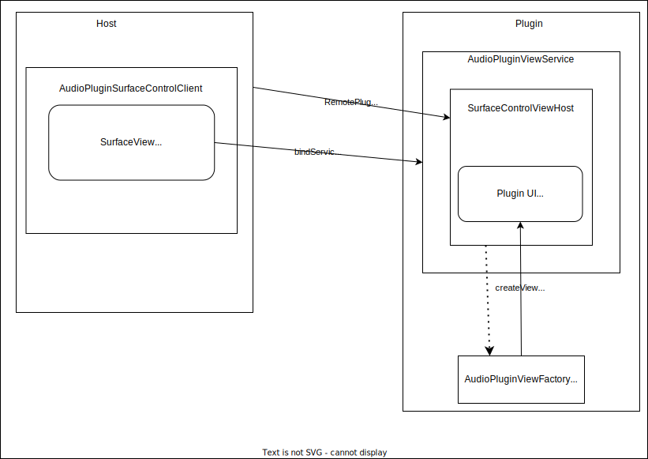

This is Nth. version of AAP GUI extension specfication draft. Every time I visit this topic, I come up with different ideas over time.

## GUI modes

Compared to other audio plugin formats, AAP has simplifying aspects and complicating aspects on GUI support: We only have to care about Android: there is no concern over multiplatform. It is similar to AUv3 caring only about iOS and macOS.

Though, we would like to be able to present the plugin UI on these methods:

- **Native View**: runs in plugin process View, using [SurfaceControlViewHost](https://developer.android.com/reference/android/view/SurfaceControlViewHost). Plugin developers can implement arbitrary native UI, as long as it runs on a `View`. Hosts need to use `SurfaceView` to reflect the plugin UI to be usable at its own UI. It is the best recommended approach by us, but requires Android 11 or later (minSdk 30).
- **WebView**: runs in host process, using `WebView` and per-plugin Web UI. It covers the widest range of target devices (down to 29 which is the minSdk for AAP itself). There is however a various restrictions on how Web UI could interact with the rest of the plugin (DSP etc.), for example direct access from plugin UI to the files in the plugin is not possible (because WebView runs on the DAW process).

Your host app could make use of native view to achieve UI like sequencer-and-plugin split pane using [Activity Embedding](https://developer.android.com/guide/topics/large-screens/activity-embedding) for tablets and foldables (which could run with the host side by side). AAP itself does not provide any feature for that.

Currently send-only (non-receiving) default GUI is implemented for Native View (using Jetpack Compose) and WebView (HTML+JS), respectively.

We provide entry points to GUI hosting in both Kotlin/Java and native. The native part is done by JNI invocation.

GUI instantiation is asynchronous, even though some part of our API looks synchronous.

Note that there are GUI toolkits that is capable of running itself solely on a `android.view.View`: Jetpack Compose is designed well so that it meets this requirement. JUCE GUI (even as of JUCE 8.0) will not work unless JUCE drastically improves the Android UI layer that currently does not implement the entire UI layer on top of `View`.

## Using GUI support API

### Kotlin

Using GUI in Kotlin API is relatively easy (as it is implemented in Kotlin).

- Hosting native UI: In `androidaudioplugin.aar`, there is `createSurfaceControl()` function in `org.androidaudioplugin.hosting.AudioPluginHostHelper` class. It returns an instance of `AudioPluginSurfaceControlClient` class. The class has `surfaceView` property which can be used as an Android `View` in the host. It needs to be "connected" to the service to render the UI by `connectUI()` function. It handles all what `SurfaceControlViewHost` needs.
- Plugin native UI: you will have to provide a few things
  - Implement your own `org.androidaudioplugin.AudioPluginViewFactory` class and register the class as `gui:ui-view-factory`  attribute in your `<plugin>` element in your `aap_metadata.xml` (see the example below for the actual XML namespace URI).
  - Then you will also have to provide `<service android:name="org.androidaudioplugin.AudioPluginViewService" ... />` element in `AndroidManifest.xml` to get plugin UI working as a service (required for SurfaceControlViewHost) for the host.
  - There is a default (and reference) implementation `ComposeAudioPluginViewFactory` in `androidaudioplugin-ui-compose.aar`.
  - There is also a reference implementation `AudioPluginWebViewFactory` that offers Web UI `WebView` as a native UI (but instantiated as a local plugin UI).
- Hosting Web UI: In `androidaudioplugin-ui-web.aar`, there is `getWebView()` function in `org.androidaudioplugin.ui.web.WebUIHostHelper` class. It returns `WebView` with special assets path handlers.
- Plugin Web UI: you will have to prepare your Web UI content, package as `web-ui.zip` (by default) and put it into `assets` directory in your plugin app. Then add `implementation` reference to `androidaudioplugin-ui-web.aar` (most likely as a Maven Artifact) in your `build.gradle(.kts)`, which adds the required content provider for hosts.

Plugin `aap_metadata.xml` example snippet:

```
  <plugin name="Instrument Sample" category="Instrument" developer="AAP Developers"
      unique-id="urn:org.androidaudioplugin/samples/aapinstrumentsample/InstrumentSample"
      library="libaapinstrumentsample.so"
      gui:ui-view-factory="org.androidaudioplugin.ui.compose.ComposeAudioPluginViewFactory"
      xmlns:gui="urn://androidaudioplugin.org/extensions/gui">
```

Plugin `AndroidManifest.xml` example snippet:

```
  <service android:name="org.androidaudioplugin.AudioPluginViewService" android:exported="true" android:label="AAPInstrumentSample">
  </service>
```

## Interaction between GUI and the rest of the plugin

### In-host-process UI: cross-process ready

To support in-host-process GUI, a plugin UI must be *cross-process ready*.

Like LV2 UI, a *cross-process ready* AAP GUI must interact with the rest of the plugin program only via the limited channels. LV2 uses Atom sequences. We use MIDI2 UMP transports. Any complicated operations (e.g. instruction to open a file and get results from file dialog) will typically have to be implemented as System Exclusive messages or MDS (Mixed Data Set).

A *cross-process ready* GUI interoperates with the plugin via the ports that are dedicated to UI, which typically are automatically populated channels: (1) a UMP input channel, and (2) a UMP output channel. There could be (3) optional sidechaining audio input channels for audio rendering (which would be expensive; it would always need `memcpy()` among audio inputs -or- outputs to GUI inputs, handled by DSP). As long as @atsushieno understands, sharing buffer between JavaScript Uint8Array and WebView seems possible, but not doable with Wasm yet (Kotlin/Wasm has such a limitation and it is explained due to platform limitation).

We can send and receive extension controller messages using MIDI 2.0 UMPs (AAPXS SysEx8).

### In-plugin-process UI: no specification

Protocol wise, in-plugin-process UI has no limitation on interaction between the UI and the rest (DSP, file access, etc.). AAP does not impose particular constraints on in-plugin-process UI (just like CLAP does not impose anything either).

Though any restriction on the underlying layer (SurfaceControlViewHost) applies. We have no control over them.

### Event queueing

While there is no constraints on interaction between DSP and in-plugin-process UI, it should be noted how typical plugins would deal with GUI inputs to DSP and reflect DSP notification outputs to GUI. It applies to both in-process GUI and cross-process GUI. If you do not follow the practice, your audio processing could be "inconsistent" (may drop some messages, may lock the audio thread, etc.).

A DSP should have only one event input sequence (there is [good explanation on why](https://cleveraudio.org/1-feature-overview/_midi/), at CLAP website) . Since typical DAW sequencer sends events via the playback engine, it will have to merge the sequencer inputs and the GUI inputs. To make it work, the DSP will have to hold an input queue for the GUI where GUI inputs are stored with timestamps (usually the timestamps would not matter though, as audio processing happen in very short duration like 10-20 msec.), and the processor will have to "unify" them, in timestamped order. Then the resulting queue is copied to the DSP event input sequence.

Since no locking should happen in ALL of those queues, the insertion operation from GUI inputs to plugin's MIDI2 input queue has to be atomic. Copying DSP output events to GUI itself does not have to be atomic, but since we have to avoid the situation that the same buffer gets overwritten by the next audio cycle, it should be atomically copied to GUI output processing queue within the audio processing cycle.

They could be part of the framework. But how to perform these tasks in optimal way is up to each app, so it is not part of implementation. We would offer some reference implementation though.

## Web UI protocol

The web UI zip archive must be provided as `content://${applicationId}.aap_zip_provider/org.androidaudioplugin.ui.web/web-ui.zip` (fixed so far). The web content should be served by each plugin service, per request by client with `pluginId` in the future.

Since it is communication between the host and the plugin, the API will have to be stable. But it only affects UI management such as GUI instantiation, and the rest part is not about host-plugin interoperability, so it's somewhat less important than AudioPluginService AIDL compatibility.

### Scripting interface for plugin

`AAPInterop` object is registered as a global object. Its members are as follows so far (types are in Kotlin):

- Logging
  - `log(s: String)` : dispatches the log string to Web UI host.
- View controllers
  - `onInitialize()` : the Web UI page JavaScript should invoke it when the Web page is loaded and the actual script *is about to begin* (e.g. at the head of `onload` event).
    - It is up to the host implementation what it will do.
    - The host might not respond to any further interop object invocation until this function is invoked (therefore it should be invoked *before* any other AAPInterop function calls).
    - AAP WebView reference implementation only logs the call.
  - `onCleanup()` : the Web UI page JavaScript should invoke it when the Web page is unloaded (e.g. at the bottom of `onunload` event).
    - The host might not handle any interop processes that are expected at cleanup (e.g. saving plugin state).
    - The host might not respond to any further interop object invocation after this function is invoked.
    - AAP WebView reference implementation only logs the call.
- DSP controllers
  - `sendMidi1(data: ByteArray)` : tells the Web UI host to "send" the MIDI message to the plugin instance. It should be translated to a UMP message for parameter change and enqueued to the event buffer for the next audio process. 
  - `setParameter(parameterId: Int, value: Double)` : tells the Web UI host to "set" a parameter value. It should be translated to a UMP message for parameter change and enqueued to the event buffer for the next audio process.
  - `write(port: Int, data: ByteArray, offset: Int, length: Int)` : tells the Web UI host to write the buffer content to port
- Plugin information retrieval
  - `getPortCount()` : returns the number of port count
  - `getPort(index: Int) : JsPortInformation` : returns the port information
  - `getParameterCount()` : returns the number of parameter count
  - `getParameter(index: Int) : JsParameterInformation` : returns the parameter information

(There should be more members, especially for retrieving port buffer content.)

`JsPortInformation` has the following members:

- `getIndex(): Int` : returns the port index
- `getName() : String` : returns the port name
- `getContent() : Int` : returns the content type (General = 0 / Audio = 1 / MIDI2 = 3)
- `getDirection() : Int` : returns the port direction (Input = 0 / Output = 1)

`JsParameterInformation` has the following members:

- `getId(): Int` : returns the parameter ID
- `getName() : String` : returns the parameter name
- `getMinValue(): Float` : returns the minimum value
- `getMaxValue(): Float` : returns the maximum value
- `getDefaultValue(): Float` : returns the default value

### WebUIHostHelper implementation details

`WebUIHostHelper.getWebView()` is a reference implementation for Web UI hosting. It takes `AudioPluginInstance` as its constructor, and it receives those event inputs from `AAPClientScriptInterface` and delegates them to `aap::RemotePluginInstance` (via `NativeRemotePluginInstance`), so that the actual inputs unification before the plugin's `process()` could be achieved at native level. A hosting application that instantiates `aap::RemotePluginInstance` is responsible to provide the plugin buffers to the UI (audio outputs, MIDI2 UMP outputs, and MIDI2 *inputs* to reflect the latest status).

## In-plugin-process View

In-plugin-process View is useful if Android Views are feasible.

In-plugin-process View can be any `android.view.View` implementation, as long as it is interoperable enough over `SurfaceControlViewHost`. The `View` instance has to be returned by `AudioPluginViewFactory.createView(context: Context, pluginId: String, instanceId: Int)`. Each plugin declares a GUI factory which must be derived from this `AudioPluginViewFactory` class. `createView()` is an abstract method. The factory class is described in `aap_metadata.xml`.

Hosting wise, we can directly use it as either `AndroidView` in Jetpack Compose, or `juce::AndroidViewComponent` in aap-juce apps.

Here are some exaples:

- `ComposeAudioPluginViewFactory` in `androidaudioplugin-ui-compose` - creates Jetpack Compose plugin view.
- `AudioPluginWebViewFactory` in - creates WebView (you can use it as an in-plugin-process View too)

Unlike Web UI protocol, we don't need DSP controllers as it is basically a matter of the plugin application itself (there is no interaction between host and process). Initialization and disposal are handled via GUI extension. The `SurfaceView` may disappear at host side, which will be notified by "disconnect" message on `AudioPluginViewService`. Plugin developers should not have to worry about it.

### SurfaceControlViewHost: controller from Kotlin API



The host will instantiate the plugin's View by sending an independent Message to an independent GUI controller (i.e. not `AudioPluginService`, not in the .aidl). It is due to current limitation on AIDL that cannot handle Message/Parcelables in .aidl that are being used in both Java and NDK.

It is done in Kotlin land, as it requires couple of Java/Kotlin classes e.g. `Service`, `SurfaceView` and `SurfaceControlViewHost.SurfacePackage` instances. Here is these internal steps to use it:

- Client creates `SurfaceView` (can be later).
- Client binds `AudioPluginViewService`. Once `ServiceConnection` is established, it sends "connect" request, with the following arguments:
  - MESSAGE_KEY_OPCODE = "opcode"
  - MESSAGE_KEY_HOST_TOKEN = "hostToken"
  - MESSAGE_KEY_DISPLAY_ID = "displayId"
  - MESSAGE_KEY_PLUGIN_ID = "pluginId"
  - MESSAGE_KEY_INSTANCE_ID = "instanceId"
  - MESSAGE_KEY_WIDTH = "width"
  - MESSAGE_KEY_HEIGHT = "height"
- `AudioPluginViewService` receives the request and instantiates `AudioPluginGuiController`. It internally constructs `SurfaceControlViewHost`, creates the `AudioPluginView` per plugin, sets it to the view host, and (asynchronously) sends `SurfacePackage` and `guiInstanceId` back to the `Messenger` specified at `replyTo` of the input `Message`.
  - The `guiInstanceId` is so far equivalent to `instanceId` but that may change in the future.
- The client handler receives the `Message`, extracts the `SurfacePackage`, and set it to the `SurfaceView` via `setChildSurfacePackage()`.

They are mapped to GUI extension API as follows:

- client calls `create()` : client AAPXS starts binding `AudioPluginViewService`. `bindService()` is an asynchronous call so it will have to wait the following process, to finally acquire its return value (`guiInstanceId`).
  - Once the services's `IBinder` is returned at `ServiceConnection.onServiceConnected()`, then it sends "connect" request (described above).
    - it waits until its handler receives the response `Message` with the `guiInstanceId` and `SurfacePackage`.

Note that this SurfaceControlViewHost GUI does not involve AudioPluginService's Binder inteaction. Things are done in its own Binder explained above and the extension API which only invokes Kotlin implementation via JNI.

## aapinstrumentsample example

There are some proof-of-concept example use of the GUI extension API, implemented in aapinstrumentsample. In particular:

- in its `build.gradle.kts`, add `implementation project(":androidaudioplugin-ui-compose")` to `dependencies { ... }`.
- in its `aap_metadata.xml` -
  - it adds `<extension>` element for the GUI extension
  - its `<plugin>` element comes with `gui:ui-view-factory` attribute (where XMLNS `gui` is `urn://androidaudioplugin.org/extensions/gui`), which indicates `androidaudioplugin.ui.compose.ComposeAudioPluginViewFactory`. It works as the in-plugin-process View factory (explained earlier). This class is to use Jetpack Compose foundation as the in-plugin-process UI.

If you want to rather use Web UI, things should be like:

- in its `build.gradle.kts`, add `implementation project(":androidaudioplugin-ui-web")` to `dependencies { ... }`. It automatically adds a `<provider>` element for the Web UI archive and brings in support for basic Web UI.
- in its `aap_metadata.xml` -
  - add `<extension>` element for the GUI extension just like it is done for native UI.
  - In `<plugin>` element, set `gui:ui-view-factory` attribute (where XMLNS `gui` is `urn://androidaudioplugin.org/extensions/gui`) as `androidaudioplugin.ui.web.AudioPluginWebViewFactory`. It works as the in-host-process View factory (explained earlier). This class is to reuse the WebView foundation as the in-plugin-process UI.
