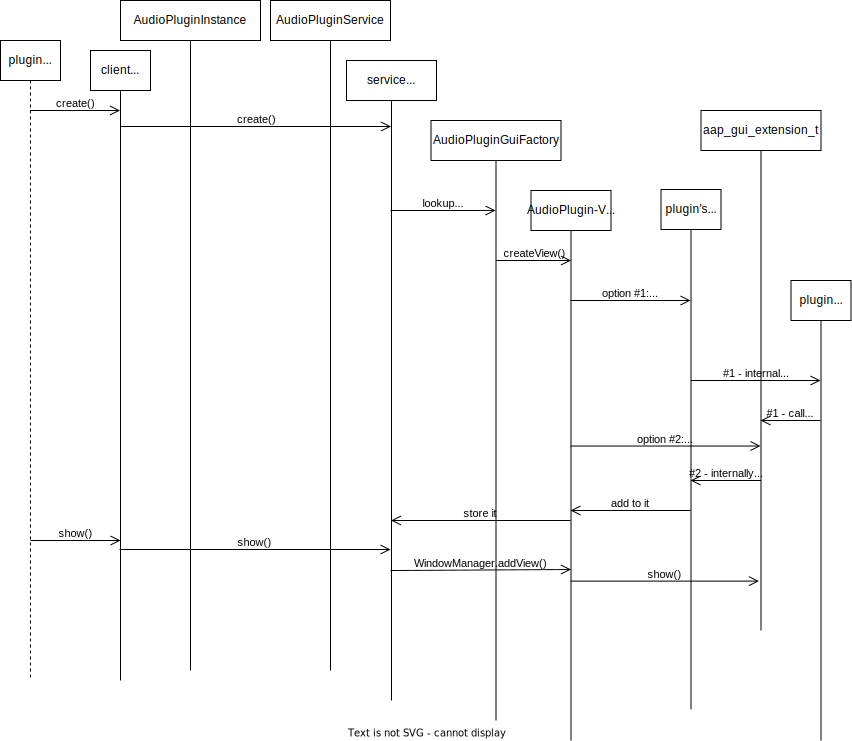

This is Nth. version of AAP GUI extension specfication draft. Every time I visit this topic, I come up with different ideas over time.

## GUI modes

Compared to other audio plugin formats, AAP has simplifying aspects and complicating aspects on GUI support: We only have to care about Android: there is no concern over multiplatform. It is similar to AUv3 caring only about iOS and macOS.

Though, we would like to be able to present the plugin UI on multiple methods:

- in host process, using WebView and per-plugin Web UI. It is the best recommended usage scenario.
- in plugin process View, by showing overlay window using [WindowManager](https://developer.android.com/reference/android/view/WindowManager). It requires special permission (`SYSTEM_ALERT_WINDOW`).
- in plugin process Activity, either by [Activity Embedding](https://developer.android.com/guide/topics/large-screens/activity-embedding) for tablets and foldables (which could run with the host side by side), or in the worst case, switching to it (then OS may kill the host process at any time!)

We have to provide entry points to GUI on both Kotlin/Java and native. The native part is most likely done by JNI invocation, but native UI toolkits (like `juce_gui_basics`) could make it complicated.

GUI instantiation is supposed to be asynchronous (the actual implementation is synchronous so far).

## Interaction between GUI and the rest of the plugin

### cross-process GUI

To support in-host-process GUI, a plugin UI must be *cross process ready*.

Like LV2 UI, a *cross process ready* AAP GUI must interact with the rest of the plugin program only via the limited channels. LV2 uses Atom sequences. We use MIDI2 UMP transports. Any complicated operations (e.g. instruction to open a file and get results from file dialog) will typically have to be implemented as System Exclusive messages or MDS (Mixed Data Set).

A *cross process ready* GUI interoperates with the plugin via the ports that are dedicated to UI, which typically are automatically populated channels: (1) a UMP input channel, and (2) a UMP output channel. There could be (3) optional sidechaining audio input channels for audio rendering (which would be expensive; it would always need `memcpy()` among audio inputs -or- outputs to GUI inputs, handled by DSP).

### In-plugin-process UI: no specification

Protocol wise, in-plugin-process UI has no limitation on interaction between the UI and the rest (DSP, file access, etc.). AAP does not impose particular constraints on in-plugin-process UI (just like CLAP does not impose anything either).

### Event queueing

While there is no constraints on interaction between DSP and in-plugin-process UI, it should be noted how typical plugins would deal with GUI inputs to DSP and reflect DSP notification outputs to GUI. It applies to both in-process GUI and cross-process GUI. If you do not follow the practice, your audio processing could be "inconsistent" (may drop some messages, may lock the audio thread, etc.).

A DSP should have only one event input sequence (there is [good explanation on why](https://cleveraudio.org/1-feature-overview/_midi/), at CLAP website) . Since typical DAW sequencer sends events via the playback engine, it will have to merge the sequencer inputs and the GUI inputs. To make it work, the DSP will have to hold an input queue for the GUI where GUI inputs are stored with timestamps (usually the timestamps would not matter though, as audio processing happen in very short duration like 10-20 msec.), and the processor will have to "unify" them, in timestamped order. Then the resulting queue is copied to the DSP event input sequence.

Since no locking should happen in ALL of those queues, the insertion operation from GUI inputs to GUI input queue has to be atomic. Copying DSP output events to GUI itself does not have to be atomic, but since we have to avoid the situation that the same buffer gets overwritten by the next audio cycle, it should be atomically copied to GUI output processing queue within the audio processing cycle.

They could be part of the framework. But how to perform these tasks in optimal way is up to each app, so it is not part of implementation. We would offer some reference implementation though.

## Web UI protocol

The web UI zip archive must be provided as `content://${applicationId}.aap_zip_provider/org.androidaudioplugin.ui.web/web-ui.zip` (fixed so far). The web content should be served by each plugin service, per request by client with `pluginId` in the future.

Since it is communication between the host and the plugin, the API will have to be stable. But it should only affect GUI instantiation and interoperability so it's somewhat less important than AudioPluginService AIDL compatibility.

### Scripting interface for plugin

`AAPInterop` object is registered as a global object. Its members are as follows so far (types are in Kotlin):

- Logging
  - `log(s: String)` : dispatches the log string to Web UI host.
- View controllers
  - `onInitialize()` : the Web UI page JavaScript should invoke it when the Web page is loaded and the actual script *is about to begin* (e.g. at the head of `onload` event).
    - It is up to the host implementation what it will do.
    - The host might not respond to any further interop object invocation until this function is invoked (therefore it should be invoked *before* any other AAPInterop function calls).
    - AAP WebView reference implementation only logs the call.
  - `onCleanup()` : the Web UI page JavaScript should invoke it when the Web page is unloaded (e.g. at the bottom of `onunload` event).
    - The host might not handle any interop processes that are expected at cleanup (e.g. saving plugin state).
    - The host might not respond to any further interop object invocation after this function is invoked.
    - AAP WebView reference implementation only logs the call.
- DSP controllers
  - `sendMidi1(data: ByteArray)` : tells the Web UI host to "send" the MIDI message to the plugin instance. It should be translated to a UMP message for parameter change and enqueued to the event buffer for the next audio process. 
  - `setParameter(parameterId: Int, value: Double)` : tells the Web UI host to "set" a parameter value. It should be translated to a UMP message for parameter change and enqueued to the event buffer for the next audio process.
  - `write(port: Int, data: ByteArray, offset: Int, length: Int)` : tells the Web UI host to write the buffer content to port
- Plugin information retrieval
  - `getPortCount()` : returns the number of port count
  - `getPort(index: Int) : JsPortInformation` : returns the port information
  - `getParameterCount()` : returns the number of parameter count
  - `getParameter(index: Int) : JsParameterInformation` : returns the parameter information

(There should be more members, especially for retrieving port buffer content.)

`JsPortInformation` has the following members:

- `getIndex(): Int` : returns the port index
- `getName() : String` : returns the port name
- `getContent() : Int` : returns the content type (General = 0 / Audio = 1 / MIDI2 = 3)
- `getDirection() : Int` : returns the port direction (Input = 0 / Output = 1)

`JsParameterInformation` has the following members:

- `getId(): Int` : returns the parameter ID
- `getName() : String` : returns the parameter name
- `getMinValue(): Float` : returns the minimum value
- `getMaxValue(): Float` : returns the maximum value
- `getDefaultValue(): Float` : returns the default value

### WebUIHostHelper implementation details

`WebUIHostHelper.getWebView()` is a reference implementation for Web UI hosting. It takes `AudioPluginInstance` as its constructor, and it receives those event inputs from `AAPClientScriptInterface` and delegates them to `aap::RemotePluginInstance` (via `NativeRemotePluginInstance`), so that the actual inputs unification before the plugin's `process()` could be achieved at native level. A hosting application that instantiates `aap::RemotePluginInstance` is responsible to provide the plugin buffers to the UI (audio outputs, MIDI2 UMP outputs, and MIDI2 *inputs* to reflect the latest status).

## In-plugin-process View

In-plugin-process View is useful if overlay window is feasible.

Every in-plugin-process View must be derived from `AudioPluginView` so that it can handle interoperability with the plugin host. The actual `AudioPluginView` is returned by `AudioPluginViewFactory.createView(pluginId: String)`. Each plugin declares a GUI factory which must be derived from this `AudioPluginViewFactory` class. `createView()` is an abstract method. The factory class is described in `aap_metadata.xml`.

The host will create a hosting `View` that attaches the plugin's `AudioPluginView`, and then is attached to the `WindowManager`. This `AudioPluginView` class has these methods:

- Logging
  - `log(s: String)` : dispatches the log string to the UI host.
- <del>View controllers</del> We are unsure if they could be supported at Kotlin/Dalvik level.
  - `onInitialize()`: it is invoked whenever it is attached to the `WindowManager`.
  - `onCleanup()` : it is invoked whenever it is detached from the `WindowManager`.
  - `onShow()` : it is invoked whenever the hosting overlay window is shown.
  - `onHide()`: it is invoked whenever the hosting overlay window is being hidden.

Unlike Web UI protocol, we don't need DSP controllers as it is basically a matter of the plugin application itself (there is no interaction between host and process).

### Instancing controller from native API

The host will instantiate the plugin's View via GUI extension: `aap_gui_extension_t` because it is the only known channel between the host and the client so far. It contains the function members below:

- `aap_gui_instance_id create(AndroidAudioPluginExtensionTarget target, const char* pluginId, int32_t pluginInstanceId, void* audioPluginView)` - returns > 0 for a new GUI instance ID or <0 for error code e.g. already instantiated or no GUI found. The actual instantiation is asynchronous.
- `void show(AndroidAudioPluginExtensionTarget target, aap_gui_instance_id guiInstanceId)` - shows the view (by using `WindowManager.addView()`)
- `void hide(AndroidAudioPluginExtensionTarget target, aap_gui_instance_id guiInstanceId)` - hides the view (by `WindowManager.removeView()`)
- `void resize(AndroidAudioPluginExtensionTarget target, aap_gui_instance_id guiInstanceId, int32_t width, int32_t height)` - resizes the View (by using `WindowManager.updateViewLayout()`. `MATCH_PARENT` and `WRAP_CONTENT` could be used as well.
- `int32_t destroy(AndroidAudioPluginExtensionTarget target, aap_gui_instance_id guiInstanceId)`

These extension functions are however not necessarily implemented by the plugin. The plugin, or the GUI AAPXS will behave totally differently:

(1) When the `AudioPluginService` instance received `create()` request, it will not go into native extension implementation directly (similar to `get_mapping_policy()` in `midi` extension). It looks for the `AudioPluginGuiFactory`, instantiate, and create `AudioPluginView` as explained above.

(2) When `AudioPluginView` is instantiated, it calls into JNI code that invokes the plugin's native `create()` function *if* it exists. It may populate the content plugin `View` to add to `audioPluginView` jobject. If it does not exist, then `createView()` is supposed to do all the work.

Since it involves Android View, it will come back to JavaVM side through JNI code in most cases. But the UI requests will have to go into the native GUI extension in any case, for unified entrypoint.

A typical GUI extension `create()` implementation would instantiate the View via some JNI call.

### processing In-plugn-process GUI requests: implementation details

`AudioPluginService` provides a non-main non-realtime `Looper` that can be used to be dispatched and handle non-realtime "messages". Those GUI extension messages, when arrived via the AAPXS, are immediately dispatched to that Looper in the native code. Those GUI requests are handled asynchronously  but consistently in the queued order.

In native code there is `NonRealtimeLoopRunner` class that manages message dispatching. It internally holds `ALooper` (the NDK public class for `Looper`), and some pre-allocated circular buffer for "messages" explained below.

As of Feb. 2022 `gui-service.cpp` implements the service AAPXS (`GuiPluginServiceExtension`). Its `onInvoked()` dispatches those requests to each JNI mediator `AAPJniFacade` to call into Dalvik VM, such as `AAPJniFacade.createGuiViaJni()` or `AAPJniFacade.showGuiViaJni()`.  Each operation is represented as a  derived class from `ALooperMessage`. They can be "created" via `NonRealtimeLoopRunner.create()` which avoids allocation in *potentially* realtime binder thread. The pre-allocated buffer works like LV2 `Atom_Forge`. The messages are then `post()`-ed to the `NonRealtimeLoopRunner`, and its non-RT processing thread picks up the posted message.

(By using `ALooper` especially `ALooper_addFd()` means, the posting and handling part still involves `write()` and `read()` which are system calls. It may sounds problematic as those functions are regarded as non-RT safe, but `write()` on pipes are atomic if it is small enough below `PIPE_BUF` size. IIRC stagefright also makes use of it so maybe this concern is kind of technical...)

## aapinstrumentsample example

There are some proof-of-concept example use of the GUI extension API, implemented in aapinstrumentsample. In particular:

- in its `build.gradle.kts`, its `dependencies { ... }` adds `implementation project(":androidaudioplugin-ui-web")` which automatically adds a `<provider>` element for the Web UI archive. Therefore it support basic Web UI.
- in its `aap_metadata.xml` -
  - it adds `<extension>` element for the GUI extension
  - its `<plugin>` element comes with `gui:ui-view-factory` attribute (where XMLNS `gui` is `urn://androidaudioplugin.org/extensions/gui`), which indicates `androidaudioplugin.ui.web.AudioPluginWebViewFactory`. It works as the in-plugin-process View factory (explained earlier). This class is to reuse the WebView foundation as the in-plugin-process UI.
