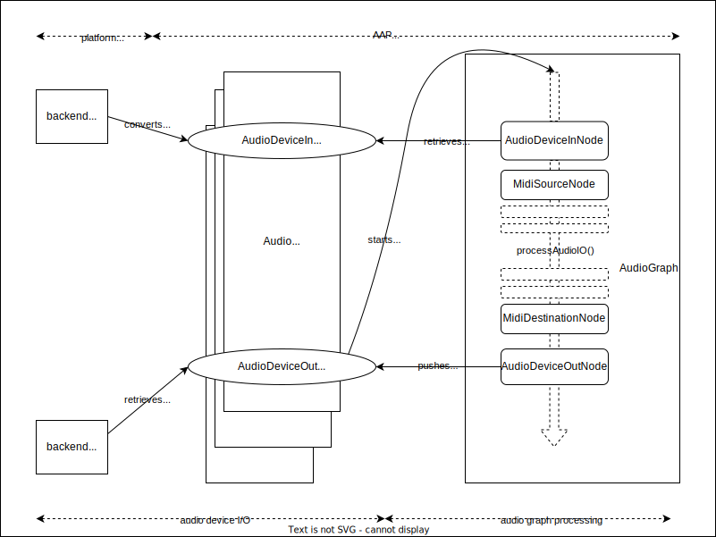

# AAP plugin manager application

`androidaudioplugin-ui-compose-app`, along with `androidaudioplugin-manager`, is designed for either a plugin or a host to manage a plugin as a client. In both cases, the app first launches `PluginList` which lists the target plugins (plugins in the app for a plugin app, plugins on the system for a host app), and let user to navigate to `PluginDetails` i.e. one particular plugin, play and/or configure it.

## androidaudioplugin-manager

`androidaudioplugin-manager` implements the plugin playback feature without the UI, mostly in native code. It has a Kotlin facade `PluginPlayer`, which delegates most of the work to C++. The feature does not really sound like that of a manager, but it is the result of (the required functionality for manager) && (required as native).

The C++ API is also supposed to be used by native apps, if applicable. We might rewrite `androidaudioplugin-midi-device-service` internals based on the new code.

It comes with `aap::SimpleLinearAudioGraph`, a sequential processor of audio nodes. It is NOT really a graph, just a `std::vector<AudioGraphNode>` indeed, but still implements some concepts for audio graph nodes. (There is also `aap::BasicAudioGraph` class, but it is not being implemented for now.)

### `AudioGraph` and `AudioGraphNode`s

`AudioGraph` is an abstract class for use in `PluginPlayer` (C++). `SimpleLinearAudioGraph` implements it (so as `BasicAudioGraph`, which is a vaporware ATM). It conceptually aggregates `AudioGraphNode`s as a directional acyclic graph (DAG). `SimpleLinearAudioGraph` does not let you edit the graph. It is a fixed list of these nodes:

- `AudioDeviceInNode`
- `AudioDataSourceNode`
- `MidiSourceNode`
- `AudioPluginNode`
- `MidiDestinationNode`
- `AudioDeviceOutNode`

The diagram below is a flow chart for the audio graph processing for current `SimpleLinearAudioGraph` design. It covers some topics explained later.

### Audio device I/O abstraction

`androidaudioplugin-manager` defines its own abstraction layer for audio device I/O. To support low latency audio, it is defined as callback API. They are abstracted away as `AudioDeviceIn` and `AudioDeviceOut`. There is `AudioDeviceManager` abstract class that open those I/O devices too. There are `Oboe` and `Virtual` implementation for them (virtual does not do anything).

Since platform audio API is different for each platform, we also abstract away the audio buffer layer, named as `AudioData` in C++ code for now.

`AudioDeviceIn` and `AudioDeviceOut` provides `setAudioCallback` function that takes `AudioDeviceCallback`. The callbacks are invoked whenever the platform audio API yields a new callback, for each.

This layer primarily takes care of these tasks:

- convert platform audio data to and from our platform-agnostic AAP audio buffer (including interleaving/de-interleaving)
- unify platform audio callbacks into our callback system consistently

#### Callbacks

To consolidate platform audio I/O from our abstract audio I/O, the `AudioDeviceOut` callback in `SimpleLinearAudioGraph` (managed by `AudioDeviceOutNode`) starts `SimpleLinearAudioGraph.processAudio()`. The caller of the callback (`OboeAudioDeviceOut`) expects a completed audio processing result within the call, and then converts the result into platform-specific audio data to write to the platform buffer.

#### Input and Output Handling

For our Oboe implementation case, `OboeAudioDeviceIn` reads the input from the Oboe callback, converts it to AAP audio data, and kicks its callback if any. `SimpleLinearAudioGraph` does not register any callback, but that does not mean we skip audio inputs. The buffered audio input should be "taken" by `AudioDeviceInNode`: it copies the inputs and sets to the outputs.

Next time `AudioDeviceIn` platform audio callback happens, the audio buffer may go away, so `AudioDeviceInNode` is supposed to take the audio data from `AudioDeviceIn` in timely manner (typically within an audio callback either from the input device or the output device).

Similarly, data sent to `AudioDeviceOutNode` will be stored within the node and is supposed to be written to the platform audio buffer, in the platform-specific format (`OboeAudioDeviceOut` does the task). The node itself does not directly writes out to `AudioDeviceOut` - it is the audio callback which is supposed to do the job.

#### Ring Buffers

Since `AudioDeviceIn` and `AudioDeviceOut` involves audio buffering and there might be need for buffering in case more than one audio-in callbacks happen while waiting for one audio-out callback and data may flush out, we store AAP audio inputs (converted from the platform audio inputs) into a ring buffer, for each device.

#### Audio Recoring Permission

One thing to note is that audio inputs needs to be explicitly enabled. In `PluginPlayer` case, it is triggered by `RECORD_AUDIO` permission checker - if it is permitted then `PluginPlayer.enableAudioRecorder()` is invoked, which in turn enables the Oboe input callback.
