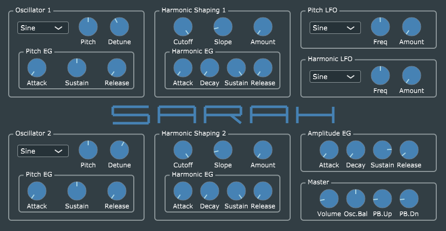

# SARAH #
**SARAH** (*Synthèse à Rapide Analyse Harmonique*, or Synthesis with Fast Harmonic Analysis) is music synthesizer plug-in built using [JUCE 5.1.2](https://www.juce.com/), and taking advantage of its newly-added DSP (digital signal processing) capabilities.

**SARAH** is an improved and expanded version of [VanillaJuce](https://github.com/getdunne/VanillaJuce) which uses the new DSP classes added in JUCE 5 to address the problem of oscillator aliasing. It works by using *juce::dsp::FFT* to transform mathematically-perfect oscillator waveforms, zeroing out unwanted high-frequency harmonics, and reverse-transforming to produce perfectly band-limited wave tables. Just for fun (and because I wanted to know if it was even possible without killing the CPU), it also implements simulated low-pass filtering in the frequency domain.

**SARAH** also illustrates how to build a conventional single-page editor GUI using standard JUCE graphics plus customized look-and-feel for traditional-looking knob controls. A limited "skinning" capability is provided, through use of a pre-rendered background image ([which can be user-specific](Skinning/README.md)).

One important capability **SARAH** doesn't yet support is *parameter automation*. I am in the process of prototyping approaches (see https://github.com/getdunne/juce-AudioParameterTest) and will be adding this soon.

## Implementation notes ##
This code has been compiled successfully using [Microsoft Visual Studio 2017, Community Edition](https://www.visualstudio.com/community) and [Apple Xcode](https://developer.apple.com/xcode/) v8.2.1. I have tested the VST2.x build under Windows 10 64-bit using the 64-bit version of Hermann Seib's [VSTHost](http://www.hermannseib.com/english/vsthost.htm), and the Mac AUv2 build under [Apple Logic Pro X](https://www.apple.com/ca/logic-pro/what-is/) v10.3.2. I have not tested the Mac VST2.x build. I have not attempted to create a Linux VST build.

I welcome feedback on the [JUCE Forum](https://forum.juce.com/), where you can find me as user **getdunne**.

## Detailed documentation ##

[Go here for more detailed information](http://getdunne.net/wiki/doku.php?id=sarah) about this project.

## Code licensing terms
This code is licensed under the terms of the MIT License (see the file *LICENSE* in this repo). To compile it, you will need a copy of the [JUCE framework](https://juce.com), and the resulting *combined work* will be subject to JUCE's own licensing terms, and under certain circumstances may become subject to the [GNU General Public License, version 3 (GPL3)](https://www.gnu.org/licenses/gpl-3.0.en.html).

I am grateful to Julian Storer of Roli, Inc. for clarifying, via the [JUCE Forum](https://forum.juce.com/t/open-source-without-gpl/29721), that this code will continue to be freely usable under the terms of the MIT license, because
1. The MIT license is "GPL3 compatible" according to the Free Software Foundation.
2. Clause 5(c) of the GPL3 specifically states that it does not invalidate less restrictive usage permissions explicitly granted by a copyright holder.
3. The JUCE license does not affect copyright status of MIT-licensed code in combined works.

In light of these considerations, and for maximum clarity, I have added my copyright notice and the full text of the MIT license to every one of the source files in this repo.

Shane Dunne, October 2018
